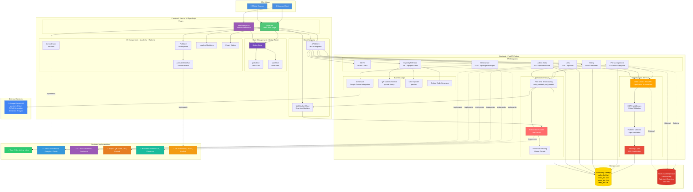

# QuickPoll Architecture

```mermaid
graph TB
    subgraph "Client Layer"
        Browser[🌐 Browser Client]
        Mobile[📱 Mobile Browser]
    end

    subgraph "Frontend - Next.js 14 TypeScript"
        subgraph "Pages"
            HomePage[page.tsx<br/>Main Polls Page]
            AdminPage[admin/page.tsx<br/>Admin Dashboard]
        end
       
        subgraph "State Management - Redux Toolkit"
            Store[Redux Store]
            PollsSlice[pollsSlice<br/>Polls Data]
            UserSlice[userSlice<br/>User Data]
        end
       
        subgraph "UI Components - shadcn/ui + Tailwind"
            PollCard[PollCard<br/>Display Polls]
            VoteBar[AnimatedVoteBar<br/>Framer Motion]
            Charts[Admin Charts<br/>Recharts]
            Skeleton[Loading Skeletons]
            Empty[Empty States]
        end
       
        subgraph "Client Services"
            APIClient[API Client<br/>HTTP Requests]
            WSClient[WebSocket Client<br/>Real-time Updates]
        end
    end

    subgraph "Backend - FastAPI Python"
        subgraph "API Endpoints"
            Health[GET /<br/>Health Check]
            PollAPI[Poll Management<br/>GET/POST /api/polls]
            VoteAPI[Voting<br/>POST /api/votes]
            LikeAPI[Likes<br/>POST /api/likes]
            AdminAPI[Admin Stats<br/>GET /api/admin/stats]
            AIAPI[AI Generate<br/>POST /api/ai/generate-poll]
            ExportAPI[Export/QR/Embed<br/>GET /api/polls/:id/qr]
        end
       
        subgraph "WebSocket Server"
            WSServer[WebSocket Handler<br/>/ws/:userId]
            Presence[Presence Tracking<br/>Viewer Counts]
            Broadcast[Real-time Broadcasting<br/>vote_updated, poll_created]
        end
       
        subgraph "Middleware & Services"
            RateLimit[Rate Limiter - SlowAPI<br/>5 polls/min, 30 votes/min]
            CORS[CORS Middleware<br/>Origin Validation]
            Validator[Pydantic Validator<br/>Input Validation]
            Security[Security Layer<br/>XSS, Sanitization]
        end
       
        subgraph "Business Logic"
            AIService[AI Service<br/>Google Gemini Integration]
            QRService[QR Code Generator<br/>qrcode library]
            CSVService[CSV Exporter<br/>pandas]
            EmbedService[Embed Code Generator]
        end
    end

    subgraph "Storage Layer"
        Memory[(In-Memory Storage<br/>polls_db: Dict<br/>votes_db: Dict<br/>users_db: Dict<br/>likes_db: Set)]
        Redis[(Redis Cache Optional<br/>Poll Caching<br/>Rate Limit Counters<br/>5min TTL)]
    end

    subgraph "External Services"
        Gemini[🤖 Google Gemini API<br/>gemini-1.5-flash<br/>AI Poll Generation<br/>Sentiment Analysis]
    end

    subgraph "Features Implementation"
        F1[✅ Core: Polls, Voting, Likes]
        F2[✅ Admin: Dashboard, Analytics, Charts]
        F3[✅ AI: Poll Generation, Sentiment]
        F4[✅ Export: QR Code, CSV, Embed]
        F5[✅ Real-time: WebSocket, Presence]
        F6[✅ UX: Animations, Toasts, Confetti]
    end

    %% Client to Frontend Connections
    Browser --> HomePage
    Mobile --> HomePage
    Browser --> AdminPage
   
    %% Frontend Internal Connections
    HomePage --> Store
    AdminPage --> Store
    Store --> PollsSlice
    Store --> UserSlice
   
    HomePage --> PollCard
    HomePage --> Skeleton
    HomePage --> Empty
    AdminPage --> Charts
    PollCard --> VoteBar
   
    HomePage --> APIClient
    HomePage --> WSClient
    AdminPage --> APIClient
   
    %% Frontend to Backend Connections
    APIClient --> Health
    APIClient --> PollAPI
    APIClient --> VoteAPI
    APIClient --> LikeAPI
    APIClient --> AdminAPI
    APIClient --> AIAPI
    APIClient --> ExportAPI
   
    WSClient --> WSServer
   
    %% Backend Middleware Flow
    PollAPI --> RateLimit
    VoteAPI --> RateLimit
    LikeAPI --> RateLimit
   
    RateLimit --> CORS
    CORS --> Validator
    Validator --> Security
   
    %% Backend to Services
    AIAPI --> AIService
    ExportAPI --> QRService
    ExportAPI --> CSVService
    ExportAPI --> EmbedService
   
    AIService --> Gemini
   
    %% Backend to Storage
    Security --> Memory
    PollAPI --> Memory
    VoteAPI --> Memory
    LikeAPI --> Memory
    AdminAPI --> Memory
   
    PollAPI -.Optional.-> Redis
    VoteAPI -.Optional.-> Redis
    RateLimit -.Optional.-> Redis
   
    %% WebSocket Flow
    WSServer --> Presence
    WSServer --> Broadcast
    Broadcast --> Memory
    Broadcast --> WSClient
   
    %% Data Flow for Real-time Updates
    VoteAPI --> Broadcast
    PollAPI --> Broadcast
    LikeAPI --> Broadcast
   
    %% Feature Connections
    PollAPI -.implements.-> F1
    VoteAPI -.implements.-> F1
    LikeAPI -.implements.-> F1
    AdminAPI -.implements.-> F2
    Charts -.implements.-> F2
    AIAPI -.implements.-> F3
    ExportAPI -.implements.-> F4
    WSServer -.implements.-> F5
    VoteBar -.implements.-> F6

    %% Styling
    style Browser fill:#4A90E2,stroke:#2E5C8A,color:#fff
    style Mobile fill:#4A90E2,stroke:#2E5C8A,color:#fff
    style HomePage fill:#50C878,stroke:#2E7D4E,color:#fff
    style AdminPage fill:#9B59B6,stroke:#6C3A7C,color:#fff
    style Store fill:#764ABC,stroke:#4A2C75,color:#fff
    style WSServer fill:#FF6B6B,stroke:#CC5555,color:#fff
    style Memory fill:#FFD700,stroke:#CCB000,color:#000
    style Redis fill:#DC382D,stroke:#A82A22,color:#fff
    style Gemini fill:#4285F4,stroke:#2A5FCC,color:#fff
    style RateLimit fill:#FFA500,stroke:#CC8400,color:#fff
    style Security fill:#E74C3C,stroke:#B83A2E,color:#fff
    style F1 fill:#2ECC71,stroke:#25A25A,color:#fff
    style F2 fill:#3498DB,stroke:#2874A6,color:#fff
    style F3 fill:#9B59B6,stroke:#7D3C98,color:#fff
    style F4 fill:#E67E22,stroke:#CA6F1E,color:#fff
    style F5 fill:#1ABC9C,stroke:#148F77,color:#fff
    style F6 fill:#F39C12,stroke:#D68910,color:#fff
```